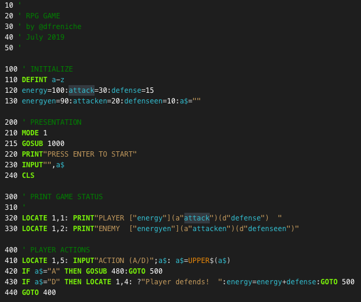

# AMSTRAD CPC Basic Helper

LOCOMOTIVE SOFTWARE AMSTRAD CPC BASIC syntax highlighting for Visual Studio Code.

* Supports all reserved words from the AMSTRAD CPC Locomotive BASIC range,
* Validates Amstrad Basic documents,
* Renumbers the currently opened BASIC file with the RENUM command, available from the Command Palette (Ctrl+Shift+P or F1).
* Can RUN simple programs that do not need to load/run/chain/merge other files. Type Ctrl+Shift+P or F1 and launch Amstrad Basic Run.



## Acknowledgments

- This started as a fork of the excellent [AMSTRAD-Basic](https://github.com/dfreniche/amstradbasic-vscode) syntax highlighting extension from dfreniche.
- Renum function rewritten for Amstrad Basic from the [COCOTools](https://marketplace.visualstudio.com/items?itemName=jasonpittman.cocotools) extension from jasonpittman.
- Validation and CPC Emulation comes from the amazing [CPCBasic](https://github.com/benchmarko/CPCBasic) project from Marco Vieth.

## Basic

### Statements

```text
AFTER, AUTO, BORDER, BREAK, CALL, CAT, CHAIN MERGE, CHAIN, CLEAR, CLG, 
CLOSEIN, CLOSEOUT, CLS, CONT, DATA, DEF FN, DEFINT, DEFSTR, DEFREAL, DEG, 
DELETE, DI, DIM, DRAW, DRAWR, EDIT, EI, ELSE, END, ENT, ENV, ERASE, ERROR, 
EVERY, FOR, GOSUB, GOTO, IF, INK, INPUT, KEY DEF, KEY, LET, LINE INPUT, LIST, 
LOAD, LOCATE, MEMORY, MERGE, MODE, MOVE, MOVER, NEW, NEXT, ON, OUT, OPENIN, 
OPENOUT, ORIGIN, PAPER, PEN, PLOT, PLOTR, POKE, PRINT, SPC, TAB, USING, RAD, 
RANDOMIZE, READ, RELEASE, RENUM, RESTORE, RESUME, RETURN, RUN, SAVE, SOUND, 
STEP, SPEED, SYMBOL, SWAP, TAG, TAGOFF, TRON, TROFF, THEN, TO, STEP, STOP, 
UNT, WAIT, WEND, WHILE, WIDTH, WINDOW, WRITE, ZONE
```

### Functions

```text
ABS, ASC, ATN, BIN, CHR$, CINT, CREAL, COS, EOF, ERR, ERL, EXP, FIX, FRE, 
HIMEM, INKEY, INKEY, INP, INTRS, INT, JOY, LEFT, LEN, LOG10, LOG, LOWER, MIN, 
MAX, MID, PEEK, PI, POS, REMAIN, RIGHT, RND, ROUND, SIN, SQ, SQR, STR$, STRING$, 
SGN, TAN, TEST, TESTR, TIME, UPPER, VAL, XPOS, YPOS
```

### Operators

```text
AND, NOT, OR, XOR, MOD
```

## Installation

Launch VS Code Quick Open (**Ctrl+P**), paste the following command, and press Enter.

```vscode
ext install amstrad-basic-helper-vscode
```

## Theme colors

To change the colors to your liking, just edit `settings.json` global file and add:

```
"editor.tokenColorCustomizations": {
        "textMateRules": [
                {
                    "scope": [
                    "keyword.control.amstradbasic"
                    ],
                    "settings": {
                        "foreground": "#79f109",
                        "fontStyle": "bold"
                    }
                },
                {
                    "scope": [
                        "entity.name.function.amstradbasic",
                    ],
                    "settings": {
                        "foreground": "#e98707"
                    }
                },
                {
                    "scope": [
                    "comment.line.amstradbasic",
                    ],
                    "settings": {
                        "foreground": "#008000",
                    }
                },
                {
                    "scope": [
                        "keyword.operator.logical.amstradbasic"
                    ],
                    "settings":{
                        "foreground": "#8E8E8E",
                    }
                },
                
                
                {
                    "scope": [
                        "variable.name.amstradbasic"
                    ],
                    "settings": {
                        "foreground": "#32bacc"
                    }
                },
                {
                    "scope": [
                        "constant.numeric.amstradbasic"
                    ],
                    "settings": {
                        "foreground": "#ffffff"
                    }
                },
                {
                    "scope": [
                        "string"
                    ],
                    "settings": {
                        "foreground": "#c2995c"
                    }
                }
                
        ]
    }
```